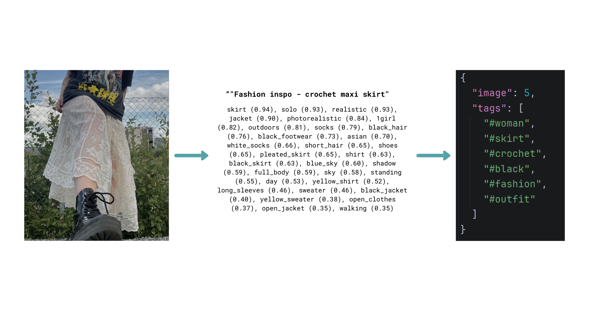
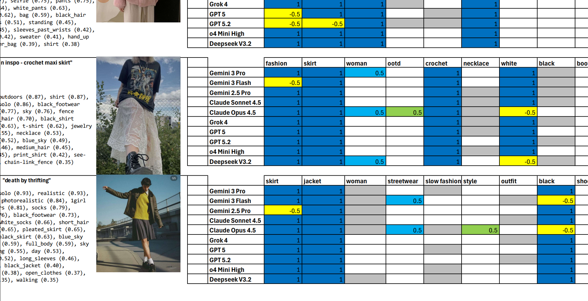
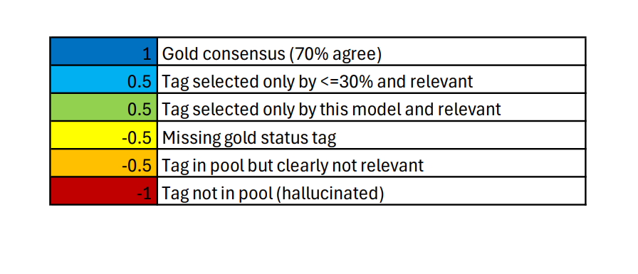
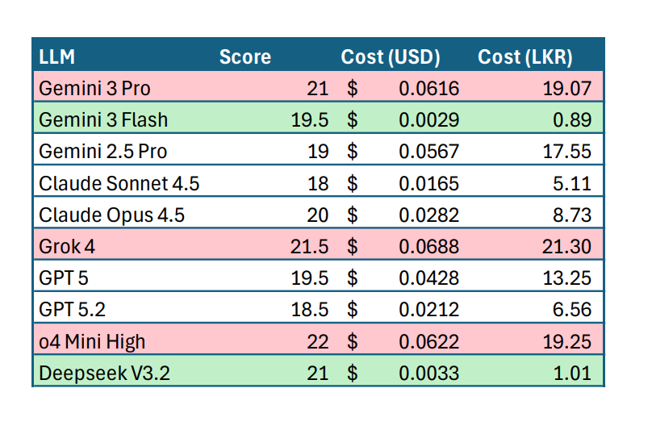

# Tumblr Tagging Automation

## The problem

When posting to platforms like Tumblr (or any other social media), tags/hashtags are important for discoverability.
However:

- It is time-consuming to manually select optimal tags for each image
- It introduces manual overhead where things could have been automated
- Quality and consistency can vary between posts

## The solution

1. Image tagging
    - Each image is visually analyzed by [wd-swinv2-tagger-v3](https://huggingface.co/SmilingWolf/wd-swinv2-tagger-v3)
    - This produces a list of visual tags (and scores) per image
2. Prompt creation
    - A single user prompt is created containing;
        - All [wd-swinv2-tagger-v3](https://huggingface.co/SmilingWolf/wd-swinv2-tagger-v3) generated tags
        - User authored captions for each image
        - A master list of allowed tags
3. LLM inference
    - An LLM uses the given prompt to output optimal tags per image

## Benchmarking

Different LLMs showed significant variation in their output quality and cost (per API call). To make an informed choice,
a simple benchmark was developed that;

1. Rewards high quality, relevant tags
2. Penalizes irrelevant/invalid tags

### Scoring methodology

Each tag produced by a model is scored individually based on how relevant it is and how it compares to other models'
outputs.

- **+1.0 – Gold consensus**
    - This tag was selected by more than 70% of models, indicating strong agreement
- **+0.5 – Minority but relevant**
    - This tag was selected by less than 30% of models, but is still *relevant*
- **+0.5 – Unique but relevant**
    - This tag was only selected by this model but is still *relevant*
- **-0.5 – Missing gold tag**
    - This tag is a gold consensus tag, but the model failed to include it
- **-0.5 – Irrelevant tag from pool**
    - This tag is from the provided tag pool but is *not relevant* to the image
- **-1.0 – Hallucinated tag**
    - This tag does not exist in the provided tag pool at all

**Note:** Whether a tag is considered *relevant* or *irrelevant* is determined manually by a human reviewer.

## Results

While models such as [Gemini 3 Pro](https://deepmind.google/models/gemini/pro/), [Grok 4](https://x.ai/api),
and [o4 Mini High](https://platform.openai.com/docs/models/o4-mini) provided excellent results, they were prohibitively
expensive for such a simple use case. On the contrary, [Gemini 3 Flash](https://deepmind.google/models/gemini/flash/)
and [Deepseek V3.2](https://api-docs.deepseek.com/quick_start/pricing) provided optimal results per dollar spent.

### Full benchmark results can be found here:

- [As PDF 📄](results/results.pdf)
- [As Excel 📊](results/results.xlsx)

## Use cases

- Automated Tumblr posting
- Social media content pipelines
- LLM prompt testing for tagging tasks

## Tech stack

- [wd-swinv2-tagger-v3](https://huggingface.co/SmilingWolf/wd-swinv2-tagger-v3) by SmilingWolf - for image tagging
- [OpenRouter](https://openrouter.ai/) - for LLM inference
- [Python 3.14](https://www.python.org/) - orchestration and benchmarking

## Legal Disclaimer

This repository contains sample images sourced from [Pinterest](https://www.pinterest.com/), purely for testing
purposes.

- I do not own these images.
- They are only used for non-commercial benchmarking.
- If you own any of these images and want them removed, please let me know.

---

This project is focused on tooling and evaluation, not content redistribution.